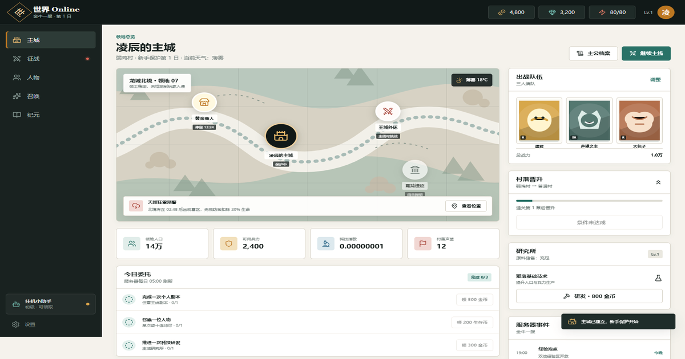

# 世界 Online MVP

《世界 Online》设定的最小可玩网页版本。从弱鸡村出发，经营主城、召唤人物、组成三人队伍，并沿九章主线挑战人物之王。

[立即游玩](https://pxz20100204.github.io/world-online-mvp/) · [报告问题](https://github.com/pxz20100204/world-online-mvp/issues)

## 已实现

- 规则测试、职业选择与开局五连礼包
- 主城经营、科技研发、任务和挂机收益
- 人物召唤、重复升星、升级、全额返还的等级重置与三人编队
- 九章小队回合制战斗、Boss 单体/AOE 技能预告、首通掉落和村落晋升
- 黄金商人、服务器事件、纪元档案及本地存档
- Supabase 全服实时聊天、频道切换与任意语言转金牛语
- 小金牛仔状态感知 AI 导引与可追问策略分析
- 阿比盖尔叛军事件、三天保护期推演与自适应决策树
- Phaser 1v1 野局、局内成长、兵线、防御塔与基地胜负
- 人物之王 IQ 800+ 受限 AI 挑战与双方英雄选择
- 桌面与移动端响应式界面

## 开始游戏

访问：https://pxz20100204.github.io/world-online-mvp/

游戏进度保存在当前浏览器的本地存储中。更换设备或清除网站数据后会重新开始。聊天使用匿名玩家会话，消息会实时同步到其他在线玩家并保存在 Supabase 中。

金牛语模式支持直接输入既有金牛语，也支持从中文、英语、西班牙语、法语、德语、葡萄牙语、俄语、日语、韩语、阿拉伯语、印地语及其他 Unicode 文字转换。未收录词汇会生成稳定词根，并在消息下方保留原文。

## AI 与叛军

- 小金牛仔会联合分析队伍战力、下一章需求、资源、行动力、任务和叛军威胁，并回答下一步、阵容、资源与叛军问题。
- 阿比盖尔会攻击玩家最依赖的金币、驻军、声望或主线节奏，预测直觉选择，并根据历史策略调整下一次行动。
- 新账号前三天只进行无损战术推演；保护结束后，叛军事件会真实影响金币、兵力、声望和情报。
- 每次事件结束后进入四小时情报冷却，防止通过重复事件无限获得奖励。

## 野局竞技

- 当前可玩模式为完整 1v1 单线野局，采用经典 MOBA 的兵线、外塔、基地、击杀、复活、等级、金币和技能冷却规则。
- 玩家从已拥有人物中选择英雄，并可指定人物之王使用完整英雄池中的任意英雄模板。
- 小兵每 8 秒刷新，防御塔优先攻击小兵；摧毁基地立即获胜，三分钟未结束则比较目标状态和击杀。
- 目标超出射程时，普攻、战技和必杀会锁定最近目标并自动接近，进入射程后立即施放；移动指令可取消追击。
- 人物之王每 400ms 最多决策一次，只评估推进、后撤、停留、普攻和三个技能，预测范围固定为 1.2 秒。
- AI 在独立线程运行，不能读取页面、存档、聊天或网络；超时会自动后撤，不会阻塞玩家界面。
- 渲染使用本地打包的 Phaser 3.90.0，并只在开始野局时按需加载；许可证位于 `vendor/PHASER-LICENSE.md`。

## 人物培养与副本

- 人物详情可以把等级重置为 Lv.1，并全额返还历次升级花费；星级、碎片和编队位置不变。
- 副本允许最多三人出战，每名存活人物每轮各行动一次，队伍行动完毕后 Boss 才出手。
- Boss 会提前显示单体或全体技能意图；AOE 分别对所有存活成员结算，稳守只为使用者提供减伤。

## 实时后端

- 浏览器仅使用 Supabase 可公开发布的客户端密钥。
- 消息表启用了行级安全策略，玩家只能以自己的匿名会话身份发送消息。
- 服务端限制同一玩家每 3 秒一条、每分钟最多 10 条消息。
- 数据库结构和安全策略位于 `supabase/schema.sql`。

## 自动部署

推送到 `main` 分支后，GitHub Actions 会自动部署当前目录到 GitHub Pages。
